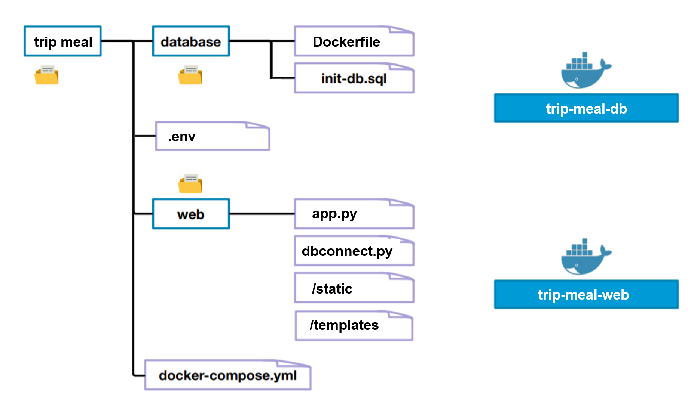

# Dockerize the TripMealApp

Dockerizing the TripMealApp application (https://github.com/DanielAndreasen/TripMeal) is the process of converting this particular app to run within a Docker container.

## Description of the TripMealApp

For this project, I chose to package the **TripMeal** application developed by Daniel Andreasen (https://github.com/DanielAndreasen). This application is a **python web app** developed under Flask which is a lightweight WSGI web application framework. In addition, the application uses an **SQL database** to store user data and the content they can generate on the web app.

In a few words, the application is a **recipe sharing platform** with an authentication system. Thus, each user with an account can log in and post recipes or consult those of others. You can get an overview of the application deployed via the Heroku platform by visiting this link : https://tripmeal.herokuapp.com/.

## Description of the project

As mentioned before, the application uses a Flask server and a SQL database to run. It is therefore naturally split into two independent services. So I created a subdirectory for each service, containing everything needed to run that service (as well as the Dockerfile).



### Database image

The goal is to create a docker image on top of the **mysql** (https://hub.docker.com/_/mysql) one that already contains the necessary scheme for the app.
To do this, the Dockerfile starts from a parent image.
```
FROM mysql
```
Then, on top of that, we have to execute the `db/init-db.sql` script to create the desired database if it doesn't already exist. When a container is started for the first time, it will execute files with extensions `.sh`, `.sql` and `.sql.gz` that are found in `/docker-entrypoint-initdb.d`, hence the second command that adds the script file `db/init-db.sql` to the `/docker-entrypoint-initdb.d` folder.
```
ADD init-db.sql /docker-entrypoint-initdb.d
``` 

### Web image

The TripMeal application relies on version 2 of python. Moreover, to install the `MYSQL-python` library present in the `requirements.txt` file, it is necessary to have a linux distribution. Thus, the parent image on which the Dockerfile is built is `python:2.7-alpine`

```
FROM python:2.7-alpine
```

Then, the following commands allow respectively to define the working directory of the container and to copy the `requirements.txt` file in this directory. The following RUN command allows to install all the libraries indicated in the `requirements.txt` file. 

```
WORKDIR app

COPY requirements.txt .

RUN set -ex \
    && apk add --no-cache --virtual .build-deps \
            gcc \
            make \
            libc-dev \
            musl-dev \
            linux-headers \
            pcre-dev \
            python-dev \
    && apk add --no-cache mariadb-dev \
    && sed '/st_mysql_options options;/a unsigned int reconnect;' /usr/include/mysql/mysql.h -i.bkp \
    && pip install -r requirements.txt \
    && runDeps="$( \
            scanelf --needed --nobanner --recursive /venv \
                    | awk '{ gsub(/,/, "\nso:", $2); print "so:" $2 }' \
                    | sort -u \
                    | xargs -r apk info --installed \
                    | sort -u \
    )" \
    && apk add --virtual .python-rundeps $runDeps \
    && apk del .build-deps
```

After having installed all the necessary dependencies, copy the entire web folder into the working directory. Copying the files is done in two steps to avoid having to download all the libraries again if someone makes a change to the python code using the docker cache system.

```
COPY . .
```

Finally, the ENTRYPOINT command allows you to start the server at container startup by specifying the appropriate python command.

```
ENTRYPOINT ["python","app.py"]
```

## Instruction

### Docker compose file

### Retrieve images

Either you can pull the images from the DockerHub registry by executing the following commands in a terminal :
```
docker pull grosclara/trip-meal-web
docker pull grosclara/trip-meal-db
```
... Or you can directly build the two images locally by placing yourself in the root folder and executing the following command :
```
docker-compose build
```


### Run images

To run the application correctly once both images are pulled either from the Dockerhub registry or either locally, simply create an `.env` file in the root folder to initialize the environment variables and run the docker-compose up command to run containers according to the instructions in the `docker-compose.yml` file.

Le fichier `.env`doit contenir les variables suivantes. Lorsque vous créez ce fichier, libre à vous de choisir la valeur de ces variables d'environnement.
```
MYSQL_DATABASE=tripmealdb
MYSQL_USER=user
MYSQL_PASSWORD=my-secret-pw
TRIPMEAL_KEY='my-secret-key'
SERVER_PORT=5000
```


